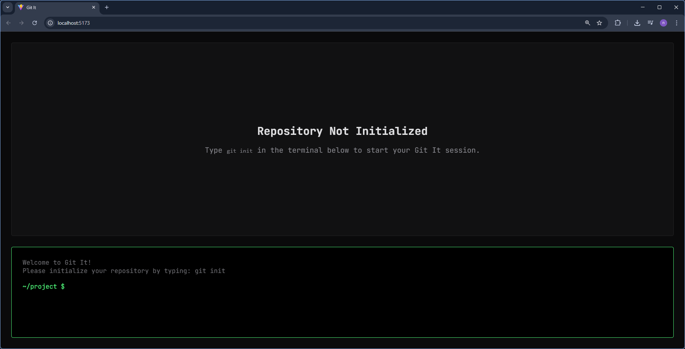
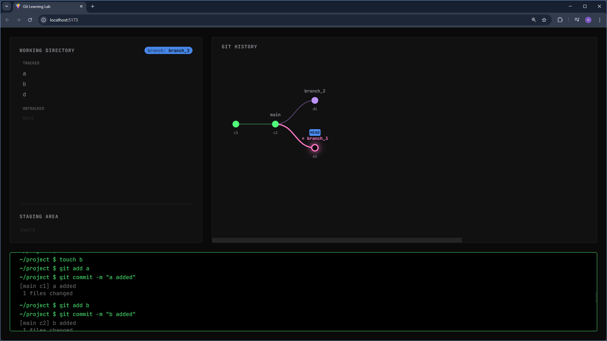
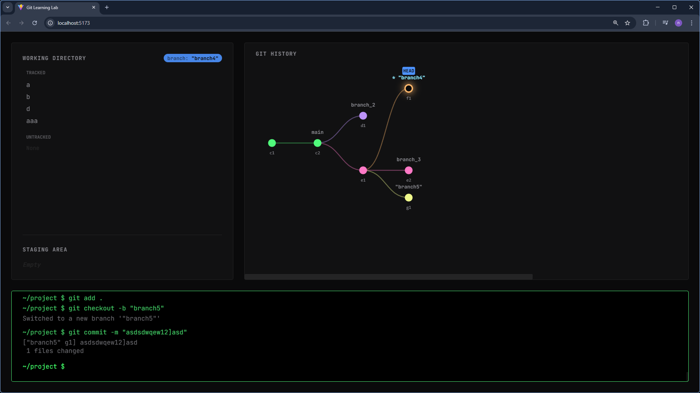

<div align="center">

# 🌳 Git It

_A personal project built initially to teach myself the core concepts of Git._

[](https://reactjs.org/)
[](https://vitejs.dev/)
[](https://d3js.org/)
[](https://www.framer.com/motion/)

</div>

<br />

## ✨ Features

- 🖥️ **Interactive Terminal**: Type real Git commands and see immediate, visual results.
- 🎨 **Dynamic Graph Visualization**: Powered by D3.js, watch your commit history, branches, and `HEAD` pointer evolve in real-time.
- 📁 **Visual Working Directory**: Instantly see files move between _Untracked_, _Staged_, and _Tracked_ states.
- ⏳ **Time Travel**: Checkout older commits and watch your physical working directory revert to exact historical snapshots.
- 🌿 **True Branching**: Create branches naturally that point to specific commits, exactly like under-the-hood Git.

## 🛠️ Tech Stack

- **Frontend Framework:** [React 19](https://react.dev/)
- **Build Tool:** [Vite](https://vitejs.dev/)
- **Data Visualization:** [D3.js](https://d3js.org/) (for the Git History graph)
- **Animations:** [Framer Motion](https://www.framer.com/motion/) (for slick file state transitions)
- **Icons:** [Lucide React](https://lucide.dev/)

## 🚀 Quick Start

Get the simulation running on your local machine in seconds.

### Prerequisites

Ensure you have [Node.js](https://nodejs.org/) installed (v18+ recommended).

### Installation

1. **Clone the repository**

   ```bash
   git clone https://github.com/notMahim24/git-game.git
   cd git-game
   ```

2. **Install dependencies**

   ```bash
   npm install
   ```

3. **Start the development server**

   ```bash
   npm run dev
   ```

4. **Open in Browser**
   Visit `http://localhost:5173` (or the port provided in your terminal) to start learning Git visually!

## 🎮 Supported Commands

Try typing these in the interactive terminal:

- `git status`, `git add .`, `git commit -m "update"`
- `git branch`, `git branch <name>`, `git checkout <branch>`
- `git checkout -b <new-branch>`, `git checkout <commit-hash>`
- `git restore --staged <file>`, `git rm <file>`
- _And more helper commands like `clear`, `touch <file>`, and `ls`!_

## 📜 License

This project is licensed under the [MIT License](LICENSE).

---

## 📸 Screenshots

<div align="center">
  
  <br/><br/>
  
  <br/><br/>
  
</div>

<br/>

<div align="center">
  <i>Built to make Git click for everyone.</i>
</div>
